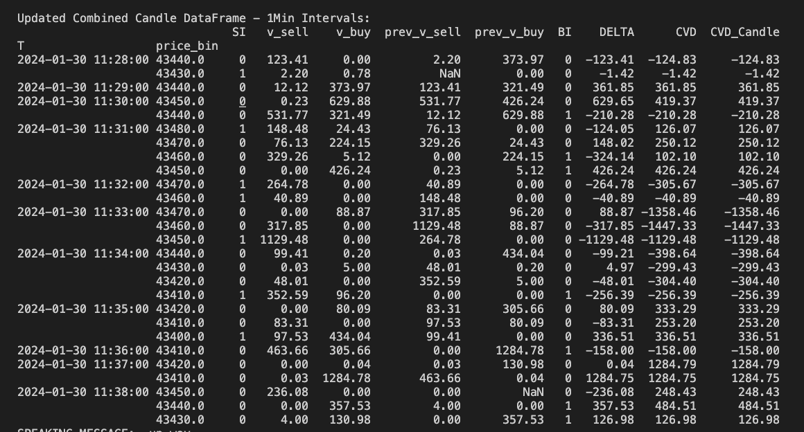
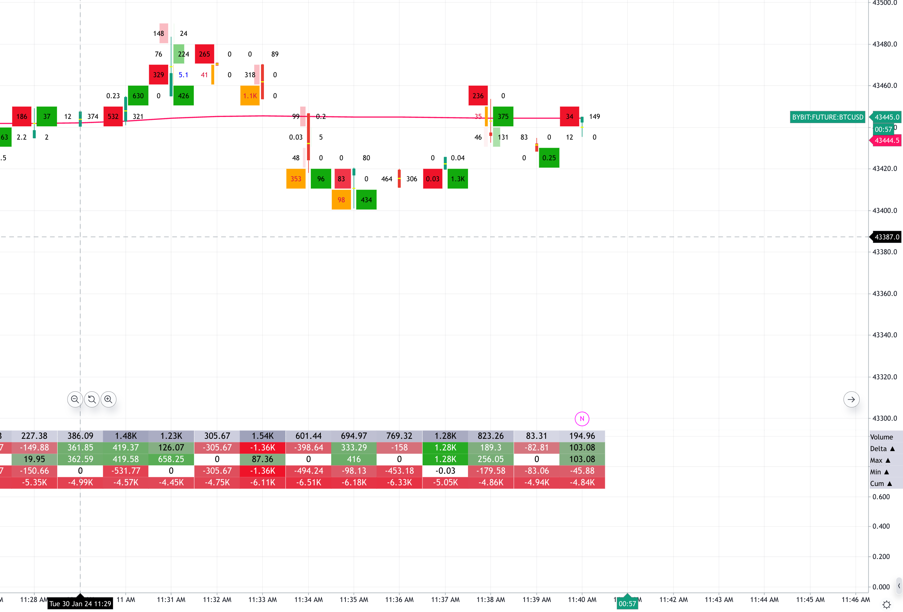

# ByBit WebSocket BTCUSD Tick Data Aggregator

## Overview

A Python script for real-time aggregation and analysis of cryptocurrency tick data, featuring volume-based candlestick calculations and imbalance detection.

This repository contains a Python script for fetching BTCUSD tick data (Time and Sales data) from ByBit using their WebSocket API. The script aggregates the data in real-time to form candles of a specified timeframe, calculates price bins, buy volume, and sell volume. Additionally, it indicates if there is an imbalance in the order book.

## Features

- **Real-time Data Fetching**: Utilizes ByBit's WebSocket API to fetch BTCUSD tick data in real-time.
  
- **Candlestick Aggregation**: Aggregates tick data into candles based on a specified timeframe.

- **Volume Analysis**: Calculates buy volume, sell volume, and identifies potential order book imbalances.

## Setup

1. **Clone the Repository:**

    ```bash
    git clone https://github.com/AakashPat/python-ordeflow-imbalance.git
    cd python-ordeflow-imbalance
    ```

2. **Install Dependencies:**

    ```bash
    pip install websocket-client pandas numpy rich playsound
    ```

3. **Configure Preferences:**

    Open the `realtime_of.py` file and update your preferred values.

    ```python
    # Max ticks to store in the dataframe (To tune performance)
    max_ticks = 1000

    # Pirce tick size to aggregate price bins in the candles
    tick_size = 10

    # Format volume to calculate in lots (1 lot = 100 contracts)
    lot_size = 100
    ```

4. **Run the Script:**

    ```bash
    python realtime_of.py
    ```

## Output



## Reference from GoCharting


